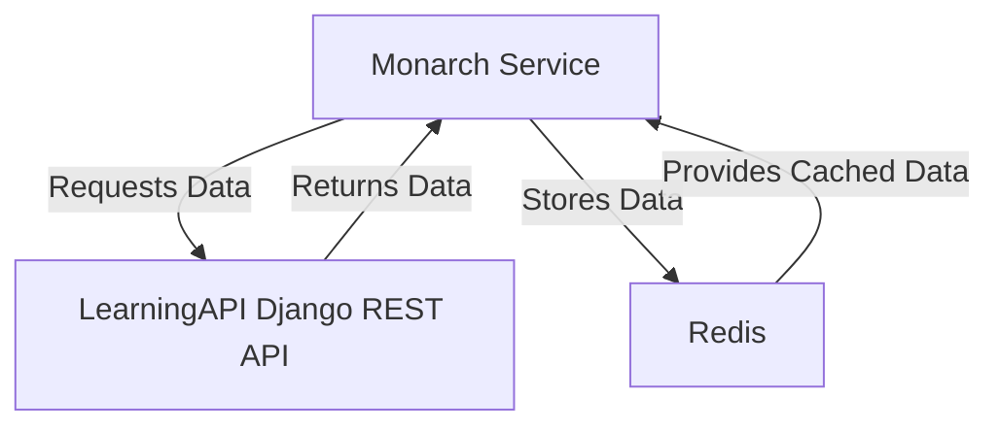

# Monarch Service

## Overview
The Monarch service is a microservice that interacts with the external LearningAPI Django REST API project to provide enhanced learning platform functionalities.

## Dependencies
- Python 3.8+
- Redis
- Django
- requests
- structlog
- pydantic
- prometheus_client
- tenacity
- pipenv

## Installation
1. Clone the repository:
    ```sh
    git clone https://github.com/stevebrownlee/learning-platform.git
    cd learning-platform/services/monarch
    ```

2. Install `pipenv` if you haven't already:
    ```sh
    pip install pipenv
    ```

3. Install the required Python packages using `pipenv`:
    ```sh
    pipenv install
    ```

4. Start the shell for the project using `pipenv`:
    ```sh
    pipenv shell
    ```
5. Open the project with your code editor.
6. Ensure Redis is installed.
7. Run the service in the terminal
    ```sh
    cd monarch
    python main.py
    ```
    or start the project in debug mode in your code editor.

## Testing with Redis-CLI

To test the Monarch service using `redis-cli`, follow these steps:

1. Start the Redis server:
    ```sh
    redis-server
    ```

2. Open a new terminal and connect to Redis CLI:
    ```sh
    redis-cli
    ```

3. Publish a test message:
    ```sh
    PUBLISH channel_migrate_issue_tickets '{ "source_repo": "nss-group-projects/cider-falls", "all_target_repositories": ["stevebrownlee/rare-test"], "notification_channel": "C06GHMZB3M3"}'
    ```

## System Diagram



## License
This project is licensed under the MIT License.

